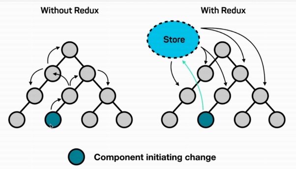
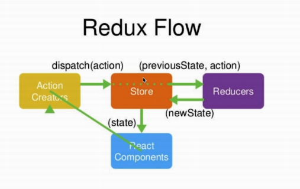

# 1 react 介绍

## 1.1 特性简介

React 原本是 Facebook自己内部使用的开发工具。自从 2013 年开源后周边的生态系更是蓬勃发展。ReactJS的出现让前端开发有许多革新性的思维出现，其中有几个重要特性值得我们去探讨：

1. 基于组件（Component）化思考
2. 用 JSX 进行宣告式（Declarative）UI 设计
3. 使用 Virtual DOM
4. Component PropType 防呆机制
5. Component 就像个状态机（State Machine），而且也有生命周期（Life Cycle）
6. 一律重绘（Always Redraw）和单向资料流（Unidirectional Data Flow）
7. 在 JavaScript 里写 CSS：Inline Style


## 1.2 基于组件化思考

​        在 React 的世界中最基本的单元为组件（Component），每个组件也可以包含一个以上的子组件，并依照需求组装成一个组合式的（Composable）组件，因此具有封装（encapsulation）、关注点分离 (Separation of Concerns)、复用 (Reuse) 、组合 (Compose) 等特性。

​        组件化一直是网页前端开发的圣杯，许多开发者最希望的就是可以最大化重复使用（reuse）过去所写的程式码，不要重复造轮子（DRY）。在 React 中组件是一切的基础，让开发应用程式就好像在堆积木一样。然而对于过去习惯模版式（template）开发的前端工程师来说，短时间要转换成组件化思考模式并不容易，尤其过去我们往往习惯于将 HTML、CSS 和 JavaScript 分离，现在却要把它们都封装在一起。

## 1.3 react安装

### 1.3.1 安装命令

```
npm install -g yarn
npm install -g create-react-app
create-react-app my-app
cd my-app/
yarn start
```

### 1.3.2 目录结构

#### 1.3.2.1 package.json 

​        管理下载的依赖包,在项目中经常用到的是"react"库，“react-dom” ，最重要的命令是“start”启动项目，"bulid"的作用就是将项目打包。 

#### 1.3.2.2 public文件夹 

1，favicon.ico 

​       浏览器tab上图标，也是这个项目的一个标志，也可以说是代表一个公司的标志。可以替换。 

2，index.html 

​         项目的入口文件，可以引用第三方类库，还可以引入csdn。root是项目的总容器，所有的内容存储在这个容器中。

（3）manifest.json

​        当web页面被用于Android主页面使用时的配置文件 。

#### 1.3.2.3 src文件 

1，index.js 

​       存放的是这个项目的核心内容，也就是我们的主要工作区域。其中，index.js文件是和index.html进行关联的文件的唯一接口 

2，App.js 

App类是继承react提供的component ，需要使用render进行渲染 ，return的内容是 jsx 。在这个文件中，只能用一个div容器，如果在div的同级目录添加别的内容，便会报错。 


# 2 渲染

## 2.1 jsx

​        React 在设计上的思路认为使用Component比起模版（Template）和显示逻辑（Display Logic）更能实现关注点分离的概念，而搭配 JSX 可以实现声明式 Declarative。

​        使用宣告式（Declarative）UI 设计很容易可以看出这个组件的功能。JSX是一种JavaScript的语法扩展。JSX用来声明 React 当中的元素 。

### 2.1.1 JavaScript 表达式

```
<button>按钮{1+1}</button>
```

### 2.1.2 三元运算

 JSX 中不能使用 if else 语句，使用 conditional (三元运算) 表达式来替代 

```
<h1>{index == 1 ? 'True!' : 'False'}</h1>
```

### 2.1.3 属性

​         在 HTML 中，我们可以透过标签上的属性来改变标签外观样式，在 JSX 中也可以，但要注意 class 和 for 由于为 JavaScript 保留关键字用法，因此在 JSX 中使用 className 和 htmlFor 替代。

```
 <h1 className="title">{index == 1 ? 'True!' : 'False'}</h1>
```

### 2.1.4 Boolean属性

JSX中预设只有属性名称但没设值为 true 

```
<input type="button" value="按钮" disabled/>
<input type="button" value="按钮" disabled={false} />
```

### 2.1.5 自定义属性

若是希望使用自定义属性，可以使用 data-： 

```
<HelloMessage data-attr="xd" />
```

### 2.1.6 样式使用

​       在 JSX 中使用外观样式方法如下，第一个 {} 是 JSX 语法，第二个为 JavaScript 物件。与一般属性值用 - 分隔不同，为驼峰式命名写法：

```
<HelloMessage style={{ color: '#FFFFFF', fontSize: '30px'}} />
```

### 2.1.7 事件处理

```
<HelloMessage onClick={this.onBtn} />
```

## 2.2 条件渲染

你可以创建不同的组件来封装各种你需要的行为。然后还可以根据应用的状态变化只渲染其中的一部分。

```
        if(this.state.isShow)
            return <h1> 显示数据</h1>
        else
            return <h1> 不显示数据</h1>
```

## 2.3 列表渲染

### 2.3.1 遍历

使用 map() 方法遍历数组

```
 List(){
        const listItems = this.state.list.map((item) =>{
                return <li>姓名是{item.name};年龄是{item.age}.</li>
        }
        );
        return listItems
    }
```

显示数据

```
  render() {

        return <div>
            <ul> {this.List()}</ul>
        </div>;

    }
```

### 2.3.2 列表设置key值

一个元素的 key 最好是这个元素在列表中拥有的一个独一无二的字符串

```
const listItems = this.state.list.map((item) =>{
                return <li key={item.id}>姓名是{item.name};年龄是{item.age}.</li>
        }
);
```

# 3 组件

## 3.1 定义一个组件

```
import React from "react";
import "./Widget.css";

export default class Widget extends React.Component {
  constructor() {
    super();
  }
  render() {
    return (<div><h1>一个组件</h1> </div>);
  }
}
```

## 3.2 生命周期

### 3.2.1 生命周期可分成三个状态

- Mounting：已插入真实 DOMimgs/life.png
- Updating：正在被重新渲染
- Unmounting：已移出真实 DOM

### 3.2.2  回调函数

- **componentWillMount** 在渲染前调用,在客户端也在服务端。
- **componentDidMount** : 在第一次渲染后调用，只在客户端。之后组件已经生成了对应的DOM结构，可以通过this.getDOMNode()来进行访问。 如果你想和其他JavaScript框架一起使用，可以在这个方法中调用setTimeout, setInterval或者发送AJAX请求等操作(防止异步操作阻塞UI)。
- **componentWillReceiveProps** 在组件接收到一个新的 prop (更新后)时被调用。这个方法在初始化render时不会被调用。
- **shouldComponentUpdate** 返回一个布尔值。在组件接收到新的props或者state时被调用。在初始化时或者使用forceUpdate时不被调用。 
  可以在你确认不需要更新组件时使用。
- **componentWillUpdate**在组件接收到新的props或者state但还没有render时被调用。在初始化时不会被调用。
- **componentDidUpdate** 在组件完成更新后立即调用。在初始化时不会被调用。
- **componentWillUnmount**在组件从 DOM 中移除之前立刻被调用。

## 3.3 复合组件

1，组件1

```
import React from "react";
import TextView from "./TextView";
export default class Widget extends React.Component {
  constructor() {
    super();

  }
  render() {
    return (<div>
      <TextView></TextView>
      <h1 > 我是第二个组件 </h1></div>);
  }
}
```

2，组件2

```
import React from "react";
export default class TextView extends React.Component {
  constructor() {
    super();
  }
  render() {
    return (
      <div>
        <h1> 我是一个组件 </h1>
      </div>
    );
  }
}
```

## 3.4 Refs

React 支持一种非常特殊的属性 Ref ，你可以用来绑定到 render() 输出的任何组件上。

这个特殊的属性允许你引用 render() 返回的相应的支撑实例（ backing instance ）。

```
import React from 'react'
import ReactDOM from 'react-dom';
class IconView extends React.Component {
    handleClick() {
        // 使用原生的 DOM API 获取焦点
        this.refs.myInput.focus();
    }
    render() {
        //  当组件插入到 DOM 后，ref 属性添加一个组件的引用于到 this.refs
        return (
            <div>
                <input type="text" ref="myInput" />
                <input
                    type="button"
                    value="点我输入框获取焦点"
                    onClick={this.handleClick.bind(this)}
                />
            </div>
        );
    }
}
export default IconView;
```

## 3.5 事件处理

### 3.5.1 事件绑定

```
<a onClick={this.deletUser.bind(this)}>Delete</a>
```

### 3.5.2 事件传值

```
<a onClick={this.deletUser.bind(this,17)}>Delete</a>
```

# 4 State值

## 4.1 State介绍

​        React 把组件看成是一个状态机（State Machines）。通过与用户的交互，实现不同状态，然后渲染 UI，让用户界面和数据保持一致。

​        在 React Component 可以自己管理自己的内部 state，并用 this.state 来存取 state。当 setState() 方法更新了 state 后将重新呼叫 render() 方法，重新绘制 component 内容。

## 4.2 设置State数据

```
this.state = {
            title:"你好"
        }
```

## 4.3 获得State数据

```
this.state.title
```

## 4.4 bind

bind() 方法与 apply 和 call很相似，也是可以改变函数体内 this 的指向。bind 是返回对应函数，便于稍后调用.

```
 <button onClick={(this.change).bind(this)}>点击按钮</button>
```

## 4.5 改变State数据

setState()方法用于更新组件的状态。 这种方法不会替代状态，而只是添加对原始状态的更改。

```
 this.setState({ title:"我很好！"})
```

# 5 Props

## 5.1 Props

state 和 props 主要的区别在于 props 是不可变的，而 state 可以根据与用户交互来改变。这就是为什么有些容器组件需要定义 state 来更新和修改数据。 而子组件只能通过 props 来传递数据。

1， 设置数据

```
<TextView title={this.state.title}/>
```

2，Props获得数据

```
<h1>TextView{this.props.title}</h1>
```

## 5.2 回调机制

1，在父组件创建方法

```
 setAge(age){
        this.setState({age:age})
    }
```

2，把父组件的方法传递给子组件

```
 <IconView  setAge={this.setAge}></IconView>
```

3，子组件保存父组件的方法

```
this.setAge=props.setAge;
```

4，子组件设置点击事件

```
 onClick={(this.changeAge).bind(this)}
```

5，子组件被点击后调用父组件的方法

```
changeAge(){
        this.state.age++;
        this.setAge(this.state.age)
    }
```

# 6 路由

## 6.1 基础

​        React Router 保持 UI 与 URL 同步。它拥有简单的 API 与强大的功能例如代码缓冲加载、动态路由匹配、以及建立正确的位置过渡处理。

### 6.1.1 安装

[npm](https://www.npmjs.com/) 安装 

```
$ npm install --save react-router-dom
$ npm install --save history
```

​        React Router 是一个基于 [React](http://facebook.github.io/react/) 之上的强大路由库，它可以让你向应用中快速地添加视图和数据流，同时保持页面与 URL 间的同步。

### 6.1.2 配置

1，引入文件

```
import { BrowserRouter as Router, Route } from "react-router-dom";
import { createHashHistory } from "history";
const history = createHashHistory();
```

（2）添加路由代码

```
   <Router history={history}>
        <Route exact path="/" component={View1} />
        <Route path="/view2" component={View2} />
      </Router>
```

注意：这里的`exact`是精确匹配的意思，比如我们有多层路由进行嵌套时，`exact`可以帮助我们精确匹配到你想跳转的路由。exact的值为bool型，为true是表示严格匹配，为false时为正常匹配。

（3）view1代码

```
import React from "react";
import { Link } from "react-router-dom";
export default class App extends React.Component {
  render() {
    return (
      <div>
        <h1>第一个页面</h1>
        <li>
          <Link to="/view2">跳转到第二个页面</Link>
        </li>
      </div>
    );
  }
}
```

（4）view2代码

```
     <div>
        <h1>我是页面2</h1>
        <li>
          <Link to="/">to view1</Link>
        </li>
      </div>
```

### 6.1.3 js执行跳转

```
this.props.history.push("/view2");
```

## 6.2 路由传参

### 6.2.1 params带参数跳转

1，路由表

```
<Route path="/view3/:id" component={View3} />
```

（2）HTML方式

```
<Link to={`/view3/2`}>跳转到第三个页面，并且带参数</Link>
```

（3）JS方式

```
let id = 2;
this.props.history.push(`/view4/${id}`);
```

（4）参数接收方式

```
props.match.params.id
```

### 6.2.2 query带参数跳转

前提：必须由其他页面跳过来，参数才会被传递过来

1，HTML方式

```
<Link to={{ pathname: "/view2", query: { id: 88 } }}>
    Link跳转带参数-query
</Link>
```

（2）JS方式

```
this.props.history.push({ pathname: "/view2", query: { id: 89 } });
```

3，参数接收方式

```
props.location.query.id
```

### 6.2.3 state带参数跳转

通过state同query差不多，只是属性不一样，而且state传的参数是加密的，query传的参数是公开的。

（1）HTML方式

```
<Link to={{ pathname: "/view3", state: { id: 188 } }}>
     Link跳转带参数-state
</Link>
```

（2）JS方式

```
 this.props.history.push({ pathname: "/view3", state: { id: 189 } });
```

（3）参数接收方式

```
props.location.state.id
```


# 7 ant

## 7.1 入门

### 7.1.1 Ant介绍

ant是基于 Ant Design 设计体系的 React UI 组件库，主要用于研发企业级中后台产品。

（1）安装框架

```
yarn add antd
npm install antd
```

（2）在index.js引入css样式

```
import "antd/dist/antd.css";
```

（3）在执行代码引入组件

```
import { Button } from "antd";
```

### 7.1.2 栅格

布局的栅格化系统，我们是基于行（row）和列（col）来定义信息区块的外部框架，以保证页面的每个区域能够稳健地排布起来。

- 通过`row`在水平方向建立一组`column`（简写 col）
- 你的内容应当放置于`col`内，并且，只有`col`可以作为`row`的直接元素
- 栅格系统中的列是指 1 到 24 的值来表示其跨越的范围。例如，三个等宽的列可以使用`.col-8`来创建
- 如果一个`row`中的`col`总和超过 24，那么多余的`col`会作为一个整体另起一行排列

```
    <Row gutter={48}>
      <Col span={12}>col-12</Col>
      <Col span={12}>col-12</Col>
    </Row>
    <Row>
      <Col span={8}>col-8</Col>
      <Col span={8}>col-8</Col>
      <Col span={8}>col-8</Col>
    </Row>
```

gutter：推荐使用 (16+8n)px 作为栅格间隔

### 7.1.3 左右偏移

使用 `offset` 可以将列向右侧偏。例如，`offset={4}` 将元素向右侧偏移了 4 个列（column）的宽度。

```
 <Row>
      <Col span={6} offset={6}>
        col-6 col-offset-6
      </Col>
      <Col span={6} offset={6}>
        col-6 col-offset-6
      </Col>
    </Row>
```

### 7.1.4 栅格排序

通过使用 push 和 pull 类就可以很容易的改变列（column）的顺序。

```
    <Row>
      <Col span={18} push={6}>
        col-18 col-push-6
      </Col>
      <Col span={6} pull={18}>
        col-6 col-pull-18
      </Col>
    </Row>
```

### 7.1.4 Flex布局

（1）row-flex 定义 flex 布局，其子元素根据不同的值 start,center,end,space-between,space-around，分别定义其在父节点里面的排版方式。

（2）Flex 子元素垂直对齐。

（3）Flex 排序：通过 Flex 布局的 Order 来改变元素的排序。


## 7.2 Layout布局

### 一，组件概述

Layout：布局容器，其下可嵌套 Header Sider Content Footer 或 Layout 本身，可以放在任何父容器中。

Header：顶部布局，自带默认样式，其下可嵌套任何元素，只能放在 Layout 中。

Sider：侧边栏，自带默认样式及基本功能，其下可嵌套任何元素，只能放在 Layout 中。

Content：内容部分，自带默认样式，其下可嵌套任何元素，只能放在 Layout 中。

Footer：底部布局，自带默认样式，其下可嵌套任何元素，只能放在 Layout 中。

```
 <Layout>
      <Sider>Sider</Sider>
      <Layout>
        <Header>Header</Header>
        <Content>Content</Content>
        <Footer>Footer</Footer>
      </Layout>
</Layout>
```

### 7.3 导航

### 7.3.1 Menu导航菜单

​       导航菜单是一个网站的灵魂，用户依赖导航在各个页面中进行跳转。一般分为顶部导航和侧边导航，顶部导航提供全局性的类目和功能，侧边导航提供多级结构来收纳和排列网站架构。

水平的顶部导航菜单

```
<Menu
        onClick={this.handleClick.bind(this)}
        selectedKeys={[this.state.current]}
        mode="horizontal"
      >
        <Menu.Item key="mail">
          <Icon type="mail" />
          Navigation One
        </Menu.Item>
        <Menu.Item key="app" disabled>
          <Icon type="appstore" />
          Navigation Two
        </Menu.Item>
        <SubMenu
          title={
            <span className="submenu-title-wrapper">
              <Icon type="setting" />
              Navigation Three - Submenu
            </span>
          }
        >
          <Menu.ItemGroup title="Item 1">
            <Menu.Item key="setting:1">Option 1</Menu.Item>
            <Menu.Item key="setting:2">Option 2</Menu.Item>
          </Menu.ItemGroup>
          <Menu.ItemGroup title="Item 2">
            <Menu.Item key="setting:3">Option 3</Menu.Item>
            <Menu.Item key="setting:4">Option 4</Menu.Item>
          </Menu.ItemGroup>
        </SubMenu>
        <Menu.Item key="alipay">
          <a
            href="https://ant.design"
            target="_blank"
            rel="noopener noreferrer"
          >
            Navigation Four - Link
          </a>
        </Menu.Item>
      </Menu>
```


### 7.3.2 垂直菜单，子菜单内嵌在菜单区域

```
 <Menu
        onClick={this.handleClick}
        style={{ width: 256 }}
        defaultSelectedKeys={['1']}
        defaultOpenKeys={['sub1']}
        mode="inline"
      >
        <SubMenu
          key="sub1"
          title={
            <span>
              <Icon type="mail" />
              <span>Navigation One</span>
            </span>
          }
        >
          <Menu.ItemGroup key="g1" title="Item 1">
            <Menu.Item key="1">Option 1</Menu.Item>
            <Menu.Item key="2">Option 2</Menu.Item>
          </Menu.ItemGroup>
          <Menu.ItemGroup key="g2" title="Item 2">
            <Menu.Item key="3">Option 3</Menu.Item>
            <Menu.Item key="4">Option 4</Menu.Item>
          </Menu.ItemGroup>
        </SubMenu>
        <SubMenu
          key="sub2"
          title={
            <span>
              <Icon type="appstore" />
              <span>Navigation Two</span>
            </span>
          }
        >
          <Menu.Item key="5">Option 5</Menu.Item>
          <Menu.Item key="6">Option 6</Menu.Item>
          <SubMenu key="sub3" title="Submenu">
            <Menu.Item key="7">Option 7</Menu.Item>
            <Menu.Item key="8">Option 8</Menu.Item>
          </SubMenu>
        </SubMenu>
        <SubMenu
          key="sub4"
          title={
            <span>
              <Icon type="setting" />
              <span>Navigation Three</span>
            </span>
          }
        >
          <Menu.Item key="9">Option 9</Menu.Item>
          <Menu.Item key="10">Option 10</Menu.Item>
          <Menu.Item key="11">Option 11</Menu.Item>
          <Menu.Item key="12">Option 12</Menu.Item>
        </SubMenu>
      </Menu>
```


# 8 联网

## 8.1 Axios 

Axios 是一个基于 promise 的 HTTP 库，可以用在浏览器和 node.js 中。

### 8.1.1 安装

```
npm install axios
```

### 8.1.2 GET请求

```
// 为给定 ID 的 user 创建请求
axios.get('/user?ID=12345')
  .then(function (response) {
    console.log(response);
  })
  .catch(function (error) {
    console.log(error);
  });

// 可选地，上面的请求可以这样做
axios.get('/user', {
    params: {
      ID: 12345
    }
  })
  .then(function (response) {
    console.log(response);
  })
  .catch(function (error) {
    console.log(error);
  });
```

### 8.1.3 POST请求

```
axios.post('/user', {
    firstName: 'Fred',
    lastName: 'Flintstone'
  })
  .then(function (response) {
    console.log(response);
  })
  .catch(function (error) {
    console.log(error);
  });
```

### 8.1.4 请求取消

```
var CancelToken = axios.CancelToken;
var source = CancelToken.source();
source.cancel();
```

### 8.1.5 qs安装

用axios以post请求的时候会出现问题，需要引入qs

```
qs.stringify()将对象 序列化成URL的形式，以&进行拼接
```

axios的post请求

```
  axios
    .post(url, qs.stringify(object))
    .then(function(response) {
      
    });
```

## 8.2 文件上传

### 8.2.1 form对象

FormData对象用以将数据编译成键值对，以便用`XMLHttpRequest`来发送数据。

（1）创建form对象

```
let param = new FormData();
```

（2）添加数据

```
param.append(key, value);
```

### 8.2.2 设置头文件

定在发送到服务器之前应该如何对表单数据进行编码

1. application/x-www-form-urlencoded：在发送前编码所有字符（默认）
2. multipart/form-data：在使用包含文件上传控件的表单时，必须使用该值。
3. text/plain：空格转换为 "+" 加号，但不对特殊字符编码。

### 8.2.3 案例

```
 //封装请求地址
  let url = serverUrl + api;
  //创建form对象
  let param = new FormData();
  for (let key in object) {
    param.append(key, object[key]);
  }
  let config = {
    headers: {
      "Content-Type": "multipart/form-data"
    }
  }; //添加请求头
  axios.post(url, param, config).then(response => {
    call(response.data);
  });
```

# 9 redux

## 9.1 基本知识

### 9.1.1 Redux简单认识



React只是一个视图层的轻量级UI框架；如果需要做一个大型的项目，需要一个数据层的大型框架和他结合起来一起去完成，首选redux。

### 9.1.2 工作流程



Store：存储数据的公共区域；图书管理员；
React Component：页面组件；  借书的用户；
Reducers：图书记录本，看图书的存放位置；
Action Creators：借书的时候，跟图书管理员说的话；

安装模块

```
npm install --save react-redux
```

### 9.1.3 Store

Store 就是保存数据的地方，你可以把它看成一个容器。整个应用只能有一个 Store。

Redux 提供createStore这个函数，用来生成 Store。

```
import { createStore } from 'redux';
const store = createStore(reducers);
```

createStore函数接受另一个函数作为参数，返回新生成的 Store 对象。

### 9.1.4 State

​         Store对象包含所有数据。如果想得到某个时点的数据，就要对 Store 生成快照。这种时点的数据集合，就叫做 State。

```
const state = store.getState();
```


### 9.1.5 Action

​        State 的变化，会导致 View 的变化。但是，用户接触不到 State，只能接触到 View。所以，State 的变化必须是 View 导致的。Action 就是 View 发出的通知，表示 State 应该要发生变化了。

​        Action 是一个对象。其中的type属性是必须的，表示 Action 的名称。其他属性可以自由设置.....

```
const sayHelloAction = {
  type: "sayHello"
};
```

Action 的名称是sayHello，它可以携带一个信息。例如

```
const sayHelloAction = {
  type: "sayHello",
  msg : "认真学习"
};
```

### 9.1.6 Action Creator

​      View 要发送多少种消息，就会有多少种 Action。可以定义一个函数来生成 Action，这个函数就叫 Action Creator。

```
const ADD_TODO = '添加 TODO';

function addTodo(text) {
  return {
    type: ADD_TODO,
    text
  }
}

const action = addTodo('Learn Redux');
```

addTodo函数就是一个 Action Creator。

### 9.1.7 store.dispatch

store.dispatch()是 View 发出 Action 的唯一方法。

```
import { createStore } from 'redux';
const store = createStore(fn);

store.dispatch({
  type: 'ADD_TODO',
  payload: 'Learn Redux'
});
```

### 9.1.8 Reducer

​        Store 收到 Action 以后，必须给出一个新的 State，这样 View 才会发生变化。这种 State 的计算过程就叫做 Reducer。

​        Reducer 是一个函数，它接受 Action 和当前 State 作为参数，返回一个新的 State。

```
const reducer = function (state, action) {
  // ...
  return new_state;
};
```

案例

```
const initialState = {
  count: 0,
  hello: "I say "
};

export default function counterReducer(state = initialState, action) {
  switch (action.type) {
    case "increase":
      return Object.assign({}, state, {
        count: state.count + 1
      });
    case "sayHello":
      return Object.assign({}, state, {
        hello: state.hello + "hello! "
      });
    default:
      return state;
  }
}
```

reducer函数收到名为increase的 Action 以后，就返回一个新的 State，作为加法的计算结果。其他运算的逻辑（比如减法），也可以根据 Action 的不同来实现。

## 9.2 React-Redux

### 9.2.1 UI 组件

​          React-Redux 将所有组件分成两大类：UI 组件（presentational component）和容器组件（container component）。

（1）UI 组件又称为"纯组件"

（2）容器组件

- 负责管理数据和业务逻辑，不负责 UI 的呈现
- 带有内部状态
- 使用 Redux 的 API

UI 组件负责 UI 的呈现，容器组件负责管理数据和逻辑

React-Redux 规定，所有的 UI 组件都由用户提供，容器组件则是由 React-Redux 自动生成。也就是说，用户负责视觉层，状态管理则是全部交给它。

### 9.2.2 connect

React-Redux 提供connect方法，用于从 UI 组件生成容器组件。connect的意思，就是将这两种组件连起来。

```
import { connect } from 'react-redux'
const App = connect(
  mapStateToProps,
  mapDispatchToProps
)(RootView);
```

（1）输入逻辑：外部的数据（即state对象）如何转换为 UI 组件的参数

（2）输出逻辑：用户发出的动作如何变为 Action 对象，从 UI 组件传出去。

connect方法接受两个参数：mapStateToProps和mapDispatchToProps。它们定义了 UI 组件的业务逻辑。前者负责输入逻辑，即将state映射到 UI 组件的参数（props），后者负责输出逻辑，即将用户对 UI 组件的操作映射成 Action。

### 9.2.3 mapStateToProps

mapStateToProps是一个函数。它的作用就是像它的名字那样，建立一个从（外部的）state对象到（UI 组件的）props对象的映射关系。mapStateToProps执行后应该返回一个对象，里面的每一个键值对就是一个映射。

```
const mapStateToProps = state => {
  return {
    count: state.counter.count,
    hello: state.counter.hello
  };
};
```

mapStateToProps是一个函数，它接受state作为参数，返回一个对象。这个对象有count属性和hello属性，代表 UI 组件的同名参数，后面的的参数是从state算出的值。

mapStateToProps会订阅 Store，每当state更新的时候，就会自动执行，重新计算 UI 组件的参数，从而触发 UI 组件的重新渲染。

### 9.2.4 mapDispatchToProps

mapDispatchToProps是connect函数的第二个参数，用来建立 UI 组件的参数到store.dispatch方法的映射。

mapDispatchToProps是一个函数，会得到dispatch和ownProps（容器组件的props对象）两个参数。

```
const mapDispatchToProps = (dispatch, ownProps) => {
  return {
    onIncreaseClick: () => {
      dispatch(increaseAction);
    },
    onSayHello: () => {
      dispatch(sayHelloAction);
    }
  };
};
```

### 9.2.5 Provider

connect方法生成容器组件以后，需要让容器组件拿到state对象，才能生成 UI 组件的参数。

一种解决方法是将state对象作为参数，传入容器组件。但是，这样做比较麻烦，尤其是容器组件可能在很深的层级，一级级将state传下去就很麻烦。

React-Redux 提供Provider组件，可以让容器组件拿到state。

```
import React from "react";
import ReactDOM from "react-dom";
import { createStore } from "redux";
import { Provider } from "react-redux";
import App from "./views/App";
import reducers from "./redux/reducers";

// Store 就是保存数据的地方，你可以把它看成一个容器。整个应用只能有一个 Store。
const store = createStore(reducers);

ReactDOM.render(
  <Provider store={store}>
    <App />
  </Provider>,
  document.getElementById("root")
);
```

Provider在根组件外面包了一层，这样一来，App的所有子组件就默认都可以拿到state了。

### 9.2.6 React-Router 路由库

```
const Root = ({ store }) => (
  <Provider store={store}>
    <Router>
      <Route path="/" component={App} />
    </Router>
  </Provider>
);
```

# 10 cookie

## 10.1 介绍

Cookie 是一些数据, 存储于你电脑上的文本文件中。

当 web 服务器向浏览器发送 web 页面时，在连接关闭后，服务端不会记录用户的信息。

Cookie 的作用就是用于解决 "如何记录客户端的用户信息":

## 10.2 安装

```
npm install react-cookie --save
```

## 10.3 数据获取

```
import cookie from 'react-cookies'
cookie.load('userId')
```

## 10.4 数据保存

```
cookie.save('userId', userId, { path: '/' });
```

## 10.5 数据删除

```
 cookie.remove('userId', { path: '/' });
```

# 11 性能优化

### 11.1 JSX优化

不要在JSX中写内联函数，这样性能有所损耗

```
 <button onClick={() => {
            this.setState({ clicked: true })
          }}>
```

- 每一次渲染这段JSX，都会产生新的函数对象
- 每一次传给SotpButton的props都是新的，这样SotpButton无法通过shouldComponentUpdate对props的检查来避免re-render


### 11.2 setState的优化

setSate书写的时候，可以直接穿一个带两个参数的函数，使得我们在重新修改state中值不用再定义变量来接收,直接和原来的值比较就可以了

```
his.setState((prev) => ({
    list: [...prev.list, prev.inputValue],
    inputValue: ''
}))
```

## 11.3 props的值

props接收的值使用es6解构的方式来接收

```
const { list,name  } = this.props
```

## 11.4 修改this指向

定义的事件修改this指向的时候,不建议写在jsx中,而是写到 constructor里面

```
constructor(props) {
        super(props)
        this.handleClick = this.handleClick.bind(this)
 }
  render() {
        const { item } = this.props
        return (
            <div>
                <div onClick={this.handleClick}>{item}</div>
            </div>
        )
    }
```

## 11.5 组件内优化

​        如果组件里面没有逻辑处理的话,只是显示一些UI效果的话,可以把组件改为无状态组件,需要展示的数据和方法直接接受父组件传过来的就可以了

```
import React, { Fragment } from 'react';
import 'antd/dist/antd.css'
import {Input,Button,List} from 'antd'
 const TodoListUI=(props)=>{
     return (
            <div className="form-box">
            <Input placeholder="请输入" value={props.inputValue} onChange={props.handleChange}style={{width:'300px'}}/>
            <Button type="primary" style={{marginLeft:'20px'}} onClick={props.handleSubmit}>提交</Button>
        </div>
     )
 }

export default TodoListUI;
```

## 11.6 ajax请求

​       请求放在(componentDidMount)中,因为componentDidMount生命周期的话,打开只会渲染一次,这样会大大的提高了性能

​       请求放在(componentDidMount)中,因为componentDidMount生命周期的话,打开只会渲染一次,这样会大大的提高了性能


